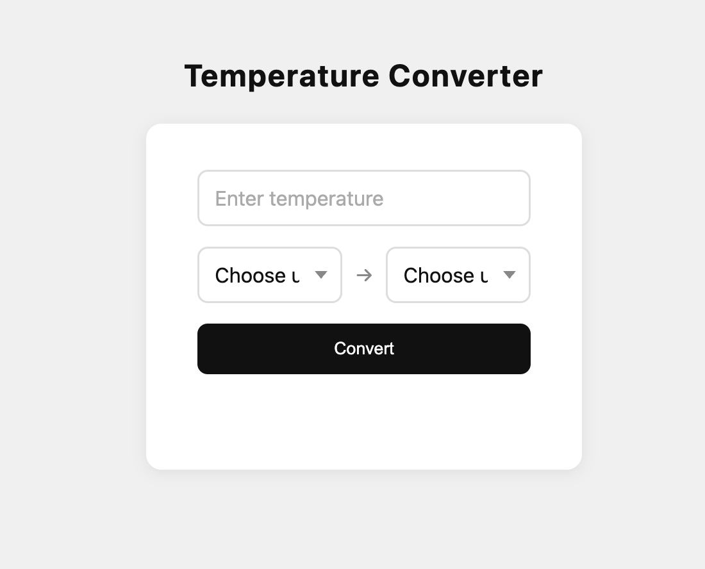

# 🌡️ temperature converter

a clean, minimal temperature converter built with vanilla html, css, and javascript.
convert between celsius, fahrenheit, and kelvin instantly.

&nbsp;

&nbsp;

---

✦ preview

---

✦ features

- 🌡️ converts between celsius, fahrenheit, and kelvin
- ✅ validates input and shows helpful error messages
- 🚫 detects temperatures below absolute zero
- 📐 clean minimal card layout, fully responsive

---

✦ built with

- HTML5 / CSS3 / JavaScript
